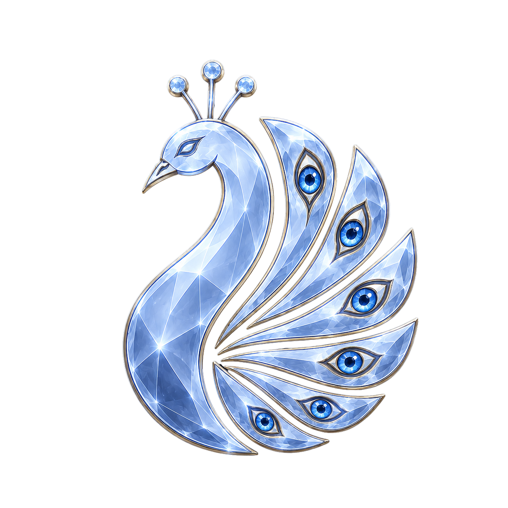

<p align="center">
  
</p>

# Project ARGUS

Widget desktop que fica no topo mostrando novidade nos seus chamados do Jira
(Nordware Service Desk) - sem precisar abrir o Jira ou depender de e-mail.

Arquitetura completa e decisões de design em [`ARQUITETURA.md`](ARQUITETURA.md).

## A origem de ARGUS

O nome vem de Argos Panoptes, o gigante de cem olhos da mitologia grega,
conhecido por sua vigilância constante.

O conceito representa a função do projeto: manter vários "olhos" sobre os
chamados e destacar quando algo exige atenção.

Na mitologia grega, após a morte de Argos, Hera preservou seus muitos olhos
nas penas da cauda do pavão, animal associado à deusa.

Por isso, o pavão foi escolhido como símbolo do ARGUS. Os "olhos" de suas
penas representam a capacidade do sistema de observar simultaneamente
diferentes chamados e estados, enquanto alerta o usuário quando algo muda ou
exige atenção.

## Uso standalone

```bash
uv venv
uv pip install -e .
cp .env.example .env   # preencher JIRA_EMAIL e JIRA_API_TOKEN
python -m argus.app
```

Gere o token em `id.atlassian.com/manage-profile/security/api-tokens` (é um
token de API, não a sua senha).

## Estado atual

Todas as fases originais concluídas - ver `ARQUITETURA.md`, seção "Estado
atual". A barra mostra os 4 status do fluxo de atendimento
(`assignee = currentUser()`), com toggle novidades/total ao clicar no ícone à
esquerda (pavão de cristal, não mais um placeholder) e lista de tickets ao
clicar num número, ordenada por pontuação de foco (1-100, combina
prioridade + urgência no texto + SLA real). O código do ticket é colorido pela
prioridade real do Jira; o título muda de cor por SLA (vermelho estourado,
laranja faltando menos de 1h, amarelo faltando menos de 2h) e ganha um sufixo
com o tempo restante em horas. Passar o mouse diretamente sobre o número
`[pontuação]` mostra a composição do valor (prioridade, urgência, SLA,
eventual piso e teto); o restante da linha não abre esse tooltip. Clicar num
ticket abre um painel de detalhes (Time to resolution,
Plataforma, Empresa, Relator, Responsável, Tipo de solicitação) ANEXADO à
janela principal (clicar em outro ticket fecha o anterior e abre um novo, na
hora), com ações rápidas (Abrir, 🔗 Copiar link, Copiar código, ⟳ Atualizar,
📌 Destacar) e, opcionalmente, "Analisar" (gera rascunho de resposta ao
cliente via LLM - só aparece se quem sobe o widget injetar esse gancho, ex.:
a GAIA). "Destacar" transforma o painel numa janela independente arrastável
(via uma barra centralizada no cabeçalho); "Reanexar" devolve pro painel
principal - ver `ARQUITETURA.md` pro detalhe completo.

Integração com a GAIA implementada: widget visual (mesma `QApplication` do
Painel) + monitoramento de voz (`JiraProvider` sozinho, sem o widget) + gancho
de análise via Groq.
