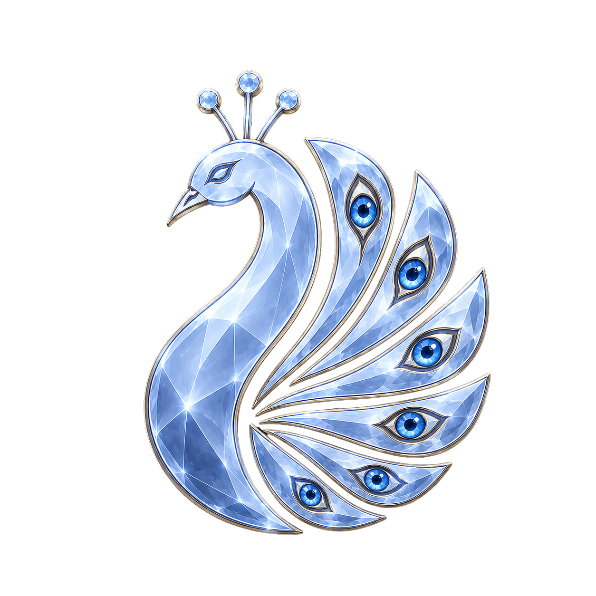

<p align="center">
  
</p>

# Project ARGUS

Widget para Windows que acompanha chamados do Jira e destaca o que precisa de atenção.

## Recursos principais

- mostra totais e novidades por status (perfil N1) ou por projeto Platz/Bahn (perfil N2);
- ordena chamados por prioridade, urgência e SLA;
- abre os detalhes sem sair do widget;
- permite copiar o código ou o link e abrir o chamado no Jira;
- continua funcionando durante falhas curtas de rede.

## Origem do nome

ARGUS vem de Argos Panoptes, o gigante de muitos olhos da mitologia grega. O nome representa a vigilância constante sobre vários chamados. Segundo uma tradição conhecida, Hera preservou os olhos de Argos na cauda do pavão depois de sua morte.

### Identidade visual

A logo mostra um pavão cristalino com vários olhos azuis na cauda. Ela reúne **Argos → muitos olhos → pavão → vigilância** em um único símbolo.

O pavão aparece de perfil, enquanto os olhos da cauda permanecem voltados para quem observa. Essa composição transmite a sensação de que o ARGUS acompanha várias direções ao mesmo tempo.

## Requisitos

- Windows;
- Python 3.11 ou mais recente;
- acesso ao Jira e um token de API.

## Instalação e uso

```powershell
uv venv
uv pip install -e .
Copy-Item .env.example .env
python -m argus.app
```

Preencha `JIRA_EMAIL` e `JIRA_API_TOKEN` no `.env`. Gere o token na página de [tokens da Atlassian](https://id.atlassian.com/manage-profile/security/api-tokens).

### Perfil N1 ou N2

- **N1 (padrão):** chamados do Service Desk (NSD) atribuídos a você, agrupados por status.
- **N2:** tickets de desenvolvimento dos projetos Platz e Bahn atribuídos a você, agrupados por projeto. O SLA e a conversa com o cliente vêm do chamado NSD de origem, e o painel mostra quem é o N1 responsável.

Troque em **Configurações... → Perfil de atendimento** (menu da bandeja, ou o botão "⚙️ Abrir configurações do Argus" no modal do Argus quando ele roda pela GAIA). `ARGUS_PERFIL=n2` no `.env` define o padrão inicial.

Use `iniciar_argus_oculto.vbs` para abrir sem deixar um terminal visível. `criar_atalho_desktop.vbs` cria um atalho na área de trabalho.

## Integrações com outros projetos

- **GAIA:** adiciona avisos por voz e permite gerar um rascunho de resposta com IA dentro do painel de detalhes.

O ARGUS continua útil sem essas integrações.

## Documentação

- [Arquitetura](docs/ARQUITETURA.md)
- [Pendências](docs/TODO.md)
- [Versionamento](docs/VERSIONAMENTO_CHANGELOG.md)
- [Histórico de versões](CHANGELOG.md)
- [Padrão de documentação](docs/PADRAO_DOCUMENTACAO.md)

## Situação atual

O widget, a pontuação de foco, o painel de detalhes e a integração opcional com a GAIA estão em uso.
